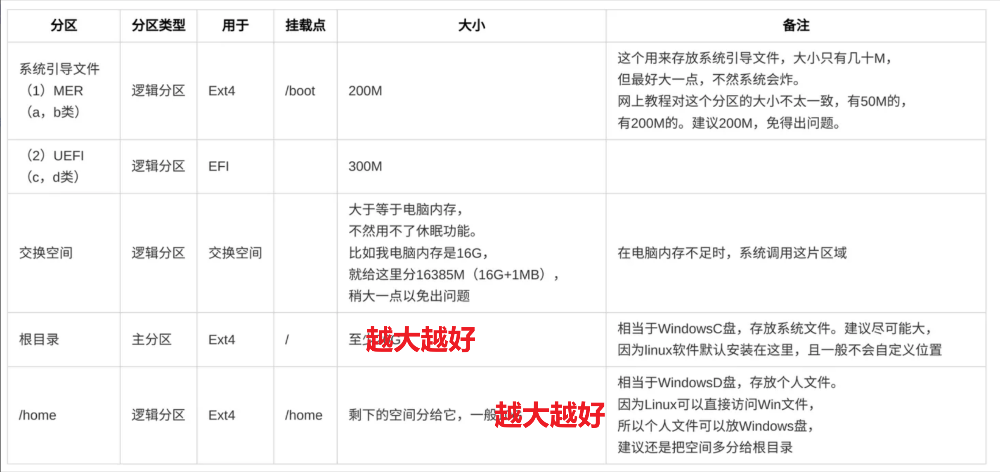
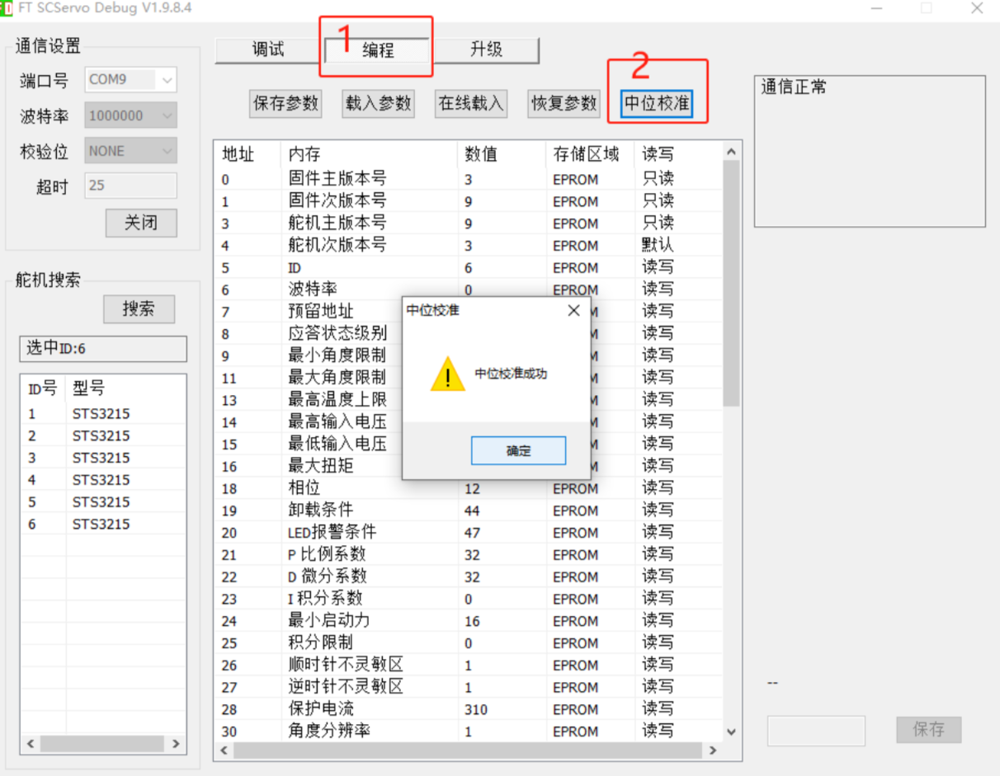

# 使用教程
这是本项目配置和使用教程

## 一、配置
### 安装Ubuntu
- [CSDN-双系统安装Ubuntu](https://blog.csdn.net/wyr1849089774/article/details/133387874?fromshare=blogdetail&sharetype=blogdetail&sharerId=133387874&sharerefer=PC&sharesource=m0_63090426&sharefrom=from_link)
- 内存分区表可以这样子改


### 安装SO-100机械臂
- [SO-100 机械臂安装文档](https://huggingface.co/docs/lerobot/v0.4.4/en/so100)

### 设置SO-100机械臂（Windows下）
- [ST3215舵机上位机](https://gitee.com/ftservo/fddebug)
    使用FD19.8.4版本飞特调试软件
- 检查每个舵机的位置，是否处于中位，中位位置应该是：2048（+-50）都可以，如果不是，就需要进行中位校正，如下图：
    

### 安装VSCode（可选）
- [鱼香ROS-一键安装](https://fishros.org.cn/forum/topic/20/%E5%B0%8F%E9%B1%BC%E7%9A%84%E4%B8%80%E9%94%AE%E5%AE%89%E8%A3%85%E7%B3%BB%E5%88%97)
- 一键安装VSCode方便查看代码，可选（非必须）

### 配置环境
- [CSDN-Ubuntu安装Anaconda](https://blog.csdn.net/2202_75569688/article/details/151618543)
- 创建虚拟环境
    ```bash
    conda create -y -n lerobot python=3.10
    ```
- 进入虚拟环境
    ```bash
    conda activate lerobot
    ```
- 安装配置
    ```bash
    pip install -e . -i https://pypi.tuna.tsinghua.edu.cn/simple
    conda install -c conda-forge ffmpeg=7 -y
    sudo apt-get install -y ffmpeg libavformat-dev libavcodec-dev  libavdevice-dev libavutil-dev libavfilter-dev libswscale-dev  libswresample-dev
    ```
    如果有libtiff.so.6相关报错，在~/.bashrc文件添加：
    ```txt
    export LD_PRELOAD=/home/wang/anaconda3/envs/robot/lib/libtiff.so.6
    ```
    再在终端输入下面指令，然后新开终端进入虚拟环境
    ```bash
    source ~/.bashrc
    ```

### 生成校准文件
- 找到对应串口号，并且给权限：(我电脑上：主臂 ttyACM0 从臂 ttyACM1)  
    将/UI/my_Imitaition_Learning.py中所有的ttyACM修改成对应的值
    ```bash
    ls /dev/ttyACM*
    sudo chmod 777 /dev/ttyACM*
    ```
- 生成主、从臂校准文件，（在lerobot文件夹的终端）执行下面代码，将机械臂旋转至所有可到位姿
    ```bash
    lerobot-calibrate \
    --teleop.type=so100_leader \
    --teleop.port=/dev/ttyACM0 \
    --teleop.id=leader
    ```
    ```bash
    lerobot-calibrate \
    --robot.type=so100_follower \
    --robot.port=/dev/ttyACM1 \
    --robot.id=follower
    ```
- 将对应的两个校准文件移到/UI/.cache/calibration/so100文件夹  
    校准文件在~/.cache/huggingface/lerobot/calibration文件夹里

### 查看摄像头序号
- 执行下面代码：(图片会保存在：outputs/captured_images，查看对应摄像头序号)
    ```bash
    python src/lerobot/scripts/lerobot_find_cameras.py
    ```
- 将/UI/my_Imitaition_Learning.py中所有的--robot.cameras对应的index_or_path参数修改成对应的序号


## 二、使用
- 进入虚拟环境
    ```bash
    cd UI
    conda activate lerobot
    ```
- 打开上位机
    ```bash
    python my_Imitaition_Learning.py
    ```
- 使用！！！

## 参考
- [HuggingFace-lerobot](https://github.com/huggingface/lerobot)